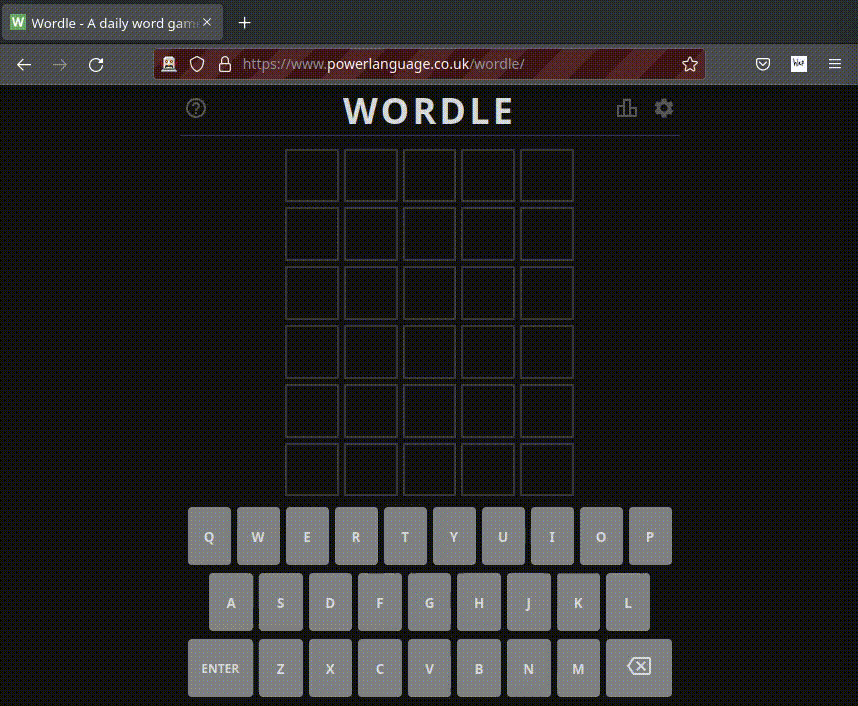

## This is not something that you might want to use if you genuinely want help in solving wordle puzzles. This is more like a proof of concept.

just to test if I can make something like this or not. Be free to fork and improve upon the code (there is a lot to improve on)

## Installation

if you still want to use this 

### for firefox 

* Download the latest release for firefox from [releases](https://github.com/shoccho/wordlep/releases) 
* Go to Add-ons and themes from the menu
* From the settings cog, open Install Add-on From File:
* Select the downloaded zip file

### for chrome
* Download the latest release for chrome from [releases](https://github.com/shoccho/wordlep/releases) and extract it
* Open your Google Chrome web browser.
* Go to chrome://extensions/ and check the box for Developer mode in the top right.
* Click on the “Load unpacked” button, and go to the location of this content of this zip file. And click on the OK button to install that Chrome extension.

## Usage
When solving the worlde click on the wordle icon it will suggest you some words
Here is a demo

